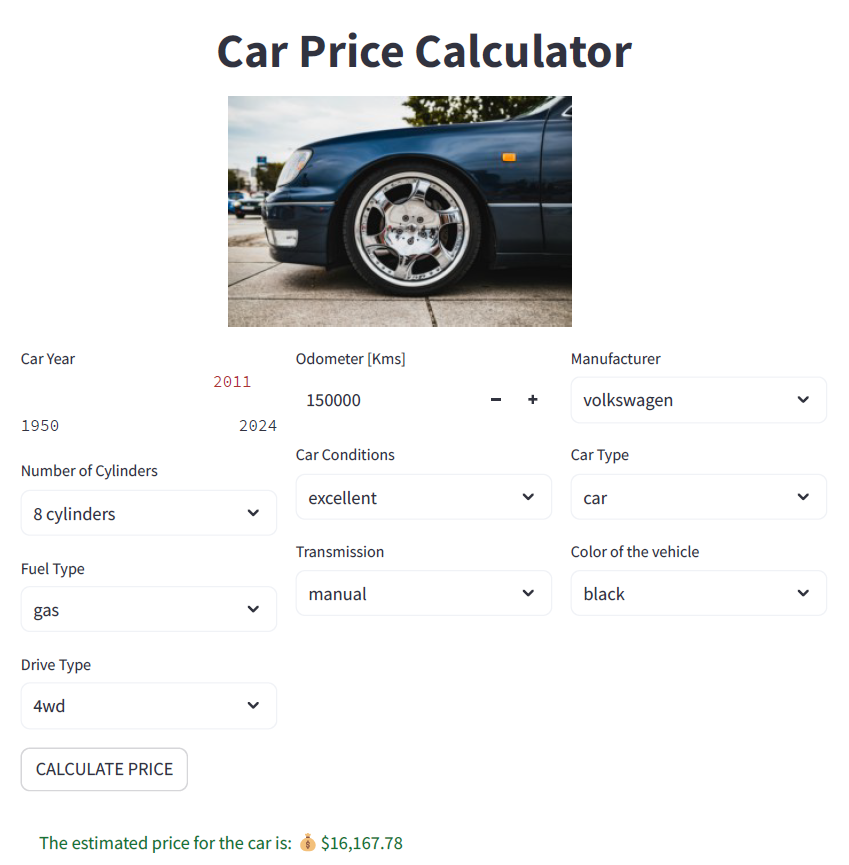
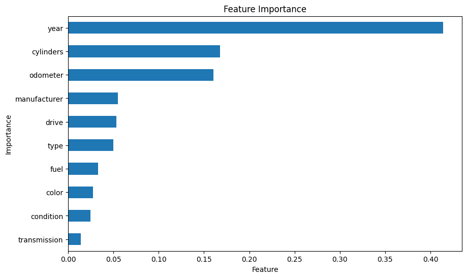

# Data Analyst

## About Me

I am a Data Analyst with a strong background in managing complex datasets, extracting valuable insights, and identifying opportunities through statistical analysis and data storytelling. I am committed to leveraging data-driven insights for impactful decision-making and optimizing business strategies.

## Technical Skills

- **Programming Languages:** Python, SQL, Git
- **Data Analysis:** Data Wrangling, Statistical Analysis, Data Visualization
- **Tools:** Microsoft Power BI, Google Sheets, Excel, Metabase, Looker Studio
- **Machine Learning:** Predictive Modeling, Algorithms
- **Frameworks:** CRISP-DM, SCRUM, DMAIC

## Projects

### [1. Car Price Prediction using Machine Learning](https://github.com/martinmedice/Car-Price-Prediction-ML-Regression)
This project involves a machine learning application designed to predict the price of used cars based on various factors such as year, mileage, and condition. The goal was to create a tool that provides accurate price estimates, showcasing skills in data analysis, predictive modeling, and interactive application development with Streamlit.

  
  

### Technologies Used
- **Languages**: Python
- **Tools and Libraries**: Pandas, NumPy, Scikit-learn, Streamlit, Pickle, Matplotlib, Seaborn

### Repository Link
[GitHub - Car Price Prediction](https://github.com/martinmedice/Car-Price-Prediction-ML-Regression)

### Additional Links
- [Exploratory Data Analysis Notebook](https://github.com/martinmedice/Car-Price-Prediction-ML-Regression/blob/main/notebooks/data_cleaning.ipynb): Explains the data cleaning and analysis process.
- [Dataset Repository](https://www.kaggle.com/datasets/austinreese/craigslist-carstrucks-data): Source of the data used in the project.

## Professional Experience

### Daat Analyst - Payments Anti-Fraud Team @Shopee Brazil 
- Utilized SQL and Python for data extraction and manipulation, conducting in-depth investigations and applying statistical tools to identify patterns in order to enhance fraud detection measures
- Identified fraud patterns and developed Power BI dashboards to monitor fraud chargeback levels and customer approval rates.
- Utilized SQL and Python for data extraction and analysis, enhancing fraud detection by 30%.

### Business Analyst - Net Promoter Score (NPS) Team @ QuintoAndar 
- Conducted data analysis to improve NPS by identifying key customer issues.
- Developed a predictive NPS model that led to a 38% reduction in contract termination lead time.

### Business Analyst - Customer Experience Team @ QuintoAndar 
- Led efforts to improve customer service KPIs, reducing queue transfers by 40%.
- Managed dashboards and project reporting to ensure effective communication across teams.

## Education & Certification

- **Bachelor in Chemical Engineering** | Federal University of São Carlos - Brazil 
- **Data Science Full Stack Certificate** | Escola DNC 
- **Scrum Foundation Certificate** | Certiprof 

## Contact

Feel free to reach out to me via [LinkedIn](https://www.linkedin.com/in/martinmedice) or [E-mail](mailto:martinmmarchelle@gmail.com) for any inquiries or collaboration opportunities.
