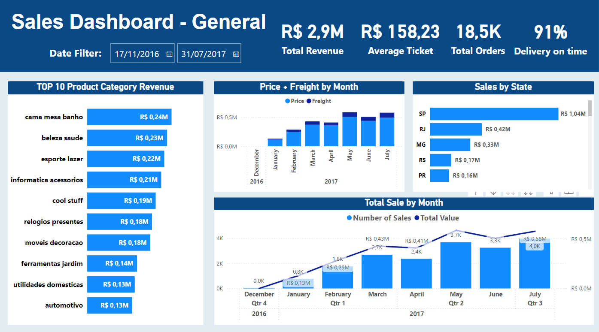
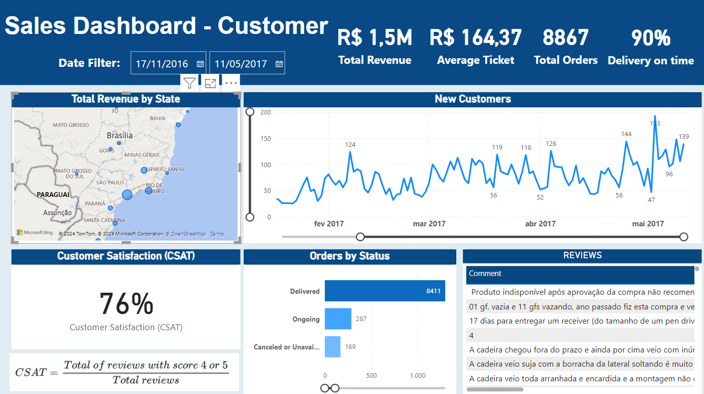
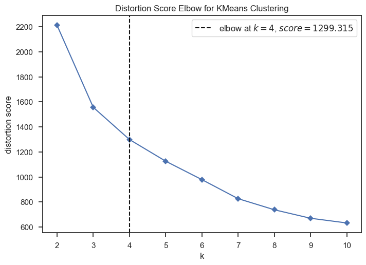
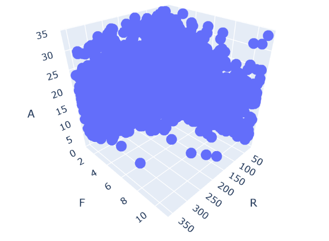
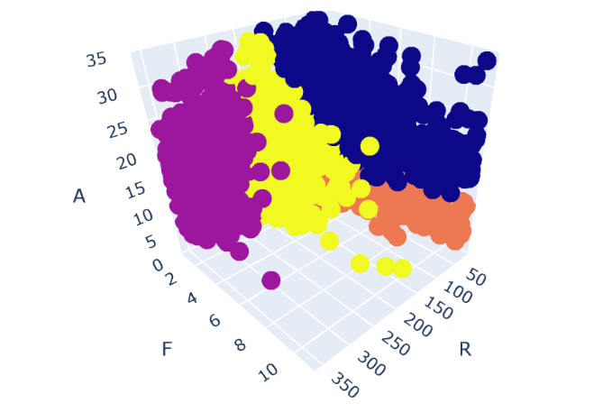
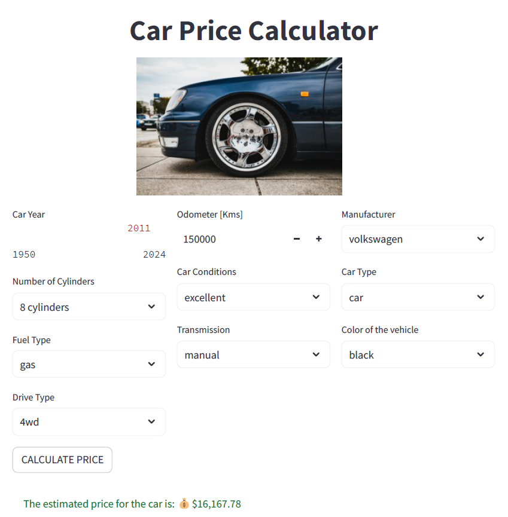
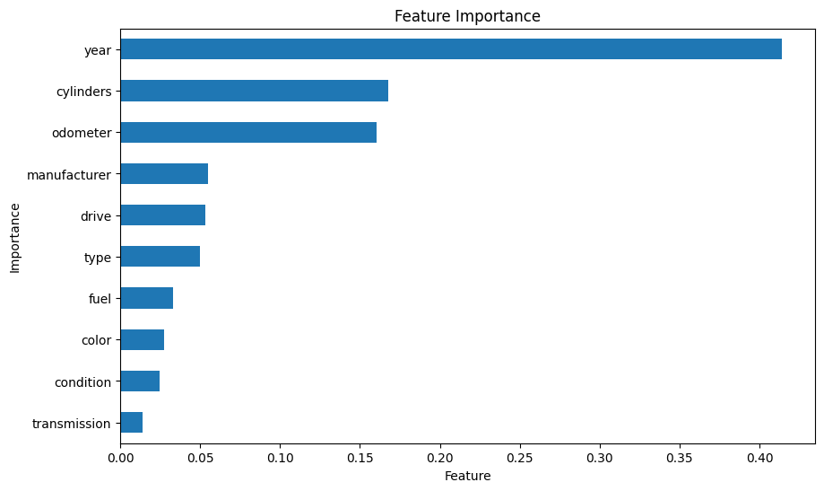

# Data Analyst Portfolio

## About Me

I am a Data Analyst with a strong background in managing complex datasets, extracting valuable insights, and identifying opportunities through statistical analysis and data storytelling. I am committed to leveraging data-driven insights for impactful decision-making and optimizing business strategies.

## Technical Skills

- **Programming Languages:** Python, SQL, Git
- **Data Analysis:** Data Wrangling, Statistical Analysis, Data Visualization
- **Tools:** Microsoft Power BI, Google Sheets, Excel, Metabase, Looker Studio
- **Machine Learning:** Predictive Modeling, Algorithms
- **Frameworks:** CRISP-DM, SCRUM, DMAIC

## Projects

### [1. Data Visualization: E-commerce Sales Dashboard](https://github.com/martinmedice/E-commerce-Dashboard)
This project consists of an interactive dashboard for analyzing sales using the Brazilian E-commerce Public Dataset by Olist. The dataset includes tables for orders, order items, customers and products allowing for comprehensive relational analysis.

  
  

### Technologies Used
- **Tools**: Microsoft Power BI
- **Data Sources**: Olist E-commerce Public Dataset (from Kaggle)
- **Other Tools**: Power Query Editor, DAX (for creating custom measures in Power BI)

### Repository Link
[GitHub - E-commerce Dashboard](https://github.com/martinmedice/E-commerce-Dashboard)

### Additional Links
- [Dataset Repository](https://www.kaggle.com/datasets/olistbr/brazilian-ecommerce): Source of the data used in the project.

_______________________________
### [2. Clustering E-commerce Customers using K-means](https://github.com/martinmedice/Kmeans-Customer-Clustering)
This project aims to segment e-commerce customers using **K-means clustering**. The original dataset contains raw transactional data from an e-commerce platform, which was transformed into Recency, Frequency, and Average Monetary Value (RFA) metrics. By clustering customers based on these metrics, businesses can develop targeted marketing strategies to improve engagement and optimize sales.

The K-means algorithm identified **4 customer segments**, each with unique characteristics:

  

- **Cluster 1**: Most valuable customers, showing high spending potential. Focus on retention and relationship building.
- **Cluster 2**: Inactive customers with low engagement. Reactivation campaigns are necessary to bring them back.
- **Cluster 3**: Engaged customers with very low spending. Focus on increasing average transaction value.
- **Cluster 4**: Somewhat inactive customers with low purchase value. Improve experience and provide personalized incentives to re-engage them.

### Cluster Profiles and Actions

| Cluster | Recency (R) | Frequency (F) | Average Monetary Value (A) | Profile Description | Suggested Actions |
|---------|-------------|---------------|----------------------------|---------------------|-------------------|
| Cluster_1  | -0.542 | -0.066 | 0.182 | Recent, Average Frequency, High Value | Loyalty programs, Cross-selling, and Upselling |
| Cluster_2  | 1.746 | -0.382 | -0.133 | Inactive, Low Frequency, Low Value | Reactivation campaigns, Personalized offers |
| Cluster_3  | -0.599 | -0.079 | -0.862 | Recent, Average Frequency, Very Low Value | Upselling, Incentives to increase spending |
| Cluster_4  | 0.608 | -0.276 | -0.202 | Somewhat inactive, Low Frequency, Low Value | Re-engagement campaigns, Improving customer experience |

  <table>
    <tr>
      <td style="text-align: center;">
        
<strong>BEFORE CLUSTERING</strong>

        
      </td>
      <td style="text-align: center;">
        
<strong>AFTER CLUSTERING</strong>

        
      </td>
    </tr>
  </table>

### Technologies Used
- **Python**: For data preprocessing, modeling, and visualization.
- **Libraries**: 
  - `pandas`, `numpy`: Data manipulation and analysis.
  - `scikit-learn`: Clustering algorithm and evaluation metrics.
  - `matplotlib`, `seaborn`, `pyplot`: Data visualization.

### Repository Link
[GitHub - Kmeans Customer Clustering](https://github.com/martinmedice/Kmeans-Customer-Clustering)

### Additional Links
- [Exploratory Data Analysis Notebook](https://github.com/martinmedice/Kmeans-Customer-Clustering/blob/main/notebooks/clustering_notebook.ipynb): Explains the data cleaning and analysis process.

_______________________________
### [3. Car Price Prediction using Machine Learning](https://github.com/martinmedice/Car-Price-Prediction-ML-Regression)
This project involves a machine learning application designed to predict the price of used cars based on various factors such as year, mileage, and condition. The goal was to create a tool that provides accurate price estimates, showcasing skills in data analysis, predictive modeling, and interactive application development with Streamlit.

  
  

### Technologies Used
- **Languages**: Python
- **Tools and Libraries**: Pandas, NumPy, Scikit-learn, Streamlit, Pickle, Matplotlib, Seaborn

### Repository Link
[GitHub - Car Price Prediction](https://github.com/martinmedice/Car-Price-Prediction-ML-Regression)

### Additional Links
- [Exploratory Data Analysis Notebook](https://github.com/martinmedice/Car-Price-Prediction-ML-Regression/blob/main/notebooks/data_cleaning.ipynb): Explains the data cleaning and analysis process.
- [Dataset Repository](https://www.kaggle.com/datasets/austinreese/craigslist-carstrucks-data): Source of the data used in the project.

## Professional Experience

### Daat Analyst - Payments Anti-Fraud Team @Shopee Brazil 
- Utilized SQL and Python for data extraction and manipulation, conducting in-depth investigations and applying statistical tools to identify patterns in order to enhance fraud detection measures
- Identified fraud patterns and developed Power BI dashboards to monitor fraud chargeback levels and customer approval rates.
- Utilized SQL and Python for data extraction and analysis, enhancing fraud detection by 30%.

### Business Analyst - Net Promoter Score (NPS) Team @ QuintoAndar 
- Conducted data analysis to improve NPS by identifying key customer issues.
- Developed a predictive NPS model that led to a 38% reduction in contract termination lead time.

### Business Analyst - Customer Experience Team @ QuintoAndar 
- Led efforts to improve customer service KPIs, reducing queue transfers by 40%.
- Managed dashboards and project reporting to ensure effective communication across teams.

## Education & Certification

- **Bachelor in Chemical Engineering** | Federal University of São Carlos - Brazil 
- **Data Science Full Stack Certificate** | Escola DNC 
- **Scrum Foundation Certificate** | Certiprof 

## Contact

Feel free to reach out to me via [LinkedIn](https://www.linkedin.com/in/martinmedice) or [E-mail](mailto:martinmmarchelle@gmail.com) for any inquiries or collaboration opportunities.
